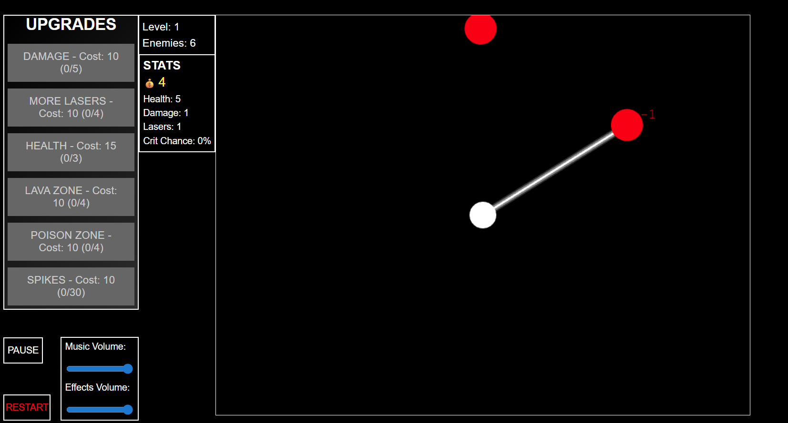

# BALL GAME

A simple browser-based survival game built with Phaser.js.
Go here to play:
https://rogerplaballus.github.io/BALL-GAME/

## Description

Control a white sphere that automatically shoots lasers at approaching red enemies. Survive waves of enemies, buy upgrades, and reach level 20 to win!

## How to Play

1. Click START to begin.
2. The white sphere in the center shoots lasers at enemies automatically.
3. Enemies move towards you - avoid contact or you'll DIE.
4. Use money earned from kills to buy upgrades.
5. Survive all enemies in each level to progress.
6. Reach level 20 and win!

## Features

- Auto-targeting laser system
- Multiple upgrade types: damage, lasers, health, lava and poison zones, spikes
- 20 challenging levels
- Sound effects and background music
- Pause and restart options

## Technologies

- HTML5
- CSS3
- JavaScript
- Phaser.js game framework

## Running the Game

Open `index.html` in a web browser to play.
